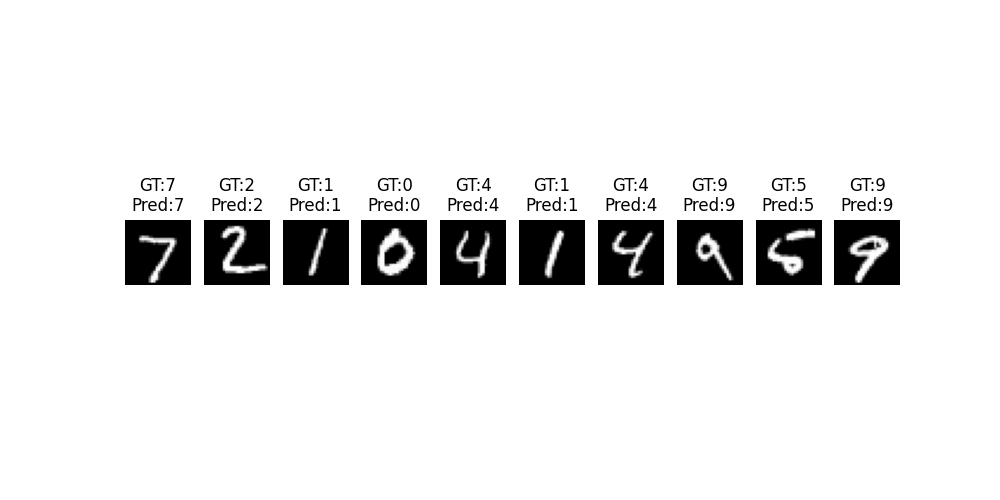

# digit-recognition-mnist
A simple NN for digit recognition using MNIST dataset

## How to Run
1. Install dependencies: pip install -r requirements.txt

2. Run the notebook:
Open `mnist_digit_recognition.ipynb` in Jupyter or Google Colab.

## Model Accuracy
Achieved 97% accuracy on the MNIST test dataset.

## Saved Model
- `mnist_digit_classifier_my.keras`: Trained model that can be loaded for inference.

## Output

 

